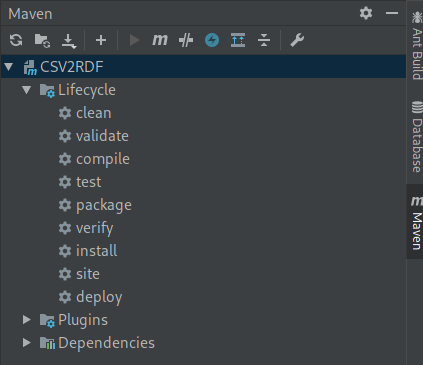

# Maven és folytonos integráció beüzemelése

Első lépésként beüzemeltük a **Mavent**. A Maven egy automatizált fordító eszköz és csomagkezelő, amelyet széles körben alkalmaznak Java nyelvű projektek fordításának automatizálásához. A projekt korábban Ant fordító eszközt használt.Mivel az **Ant** leíró fájlja (*build.xml*) bonyolult, és a projekt egy **lib** nevű **mappában** tárolta a lefordított függőségeit a forráskódok között, úgy döntöttünk, hogy áttérünk Maven használatára.

> A **Maven** automatikusan **letölti** a *pom.xml* fájlban hivatkozott függőségeket a fordítás első lépéseként. Így nem kell előre lefordított *Java bytecode* forrásállományokat tárolnunk, valamint könnyen aktualizálhatóak a függőségek.

A Maven projektet az IntelliJ IDEA integrált fejlesztőkörnyezet könnyedén meg tudja nyitni, ha az IDEA elindítása után az open menüpontot és a projektet tartalmazó mappát választjuk. Jobb oldalt megjelenik a Maven menü, ahonnan különböző fordítási és futtatási opciókat tudunk elérni.

Az alapértelmezett fordítási opció: 

> `mvn -B package` 

Ez a parancs létrehozza a **build** mappában a lefordított forrásállományokat és a futtatható java alkalmazást (CSV2RDF.jar).

    
<em>Maven menü az IntelliJ IDEA jobb oldalán.</em>

A Maven konfigurációs fájljába (*pom.xml*) összesen 9 függőséget vettünk fel. A függőségek felvételekor meg kellett adnunk a kiválasztott függőség verzióját is. A csomagok esetén a legfrissebb verziót adtuk meg, ezért szükségessé vált a projekt frissítése az újabb API-khoz. A frissítéseket elvégeztük, több esetben problémát okozott a régi függőségek lecserélése, így ez viszonylag hosszadalmas folyamat volt.

    
<em>Függőség a Maven konfigurációs fájljában.</em>

A *pom.xml* fájlt módosítottuk, hogy létrehozza a lefordított forrásállományokat tartalmazó jar fájlt olyan módon, hogy a projekt függőségei is belekerüljenek. Így lehetővé tettük, hogy a forráskódból egyetlen gombnyomásra egy teljes futtatható program készüljön.

A projekt frissítése után módosítottuk a *README.md* állományt az új könyvtárakhoz.

A tárhelyen létrehozunk egy **maven.yml** fájlt a folytonos integráció elősegítéséhez. A folytonos integráció során a környezet feltelepítése után az alábbi parancsot futtatjuk: 

> `mvn -B package sonar:sonar` 

A parancs hatására nem csak elkészítjük a lefordított forrásállományokat, a SonarCloud platform számára elemezzük a projektet. A SonarCloud platformról a dokumentáció egy későbbi fejezetében bővvebben fogunk még írni.

