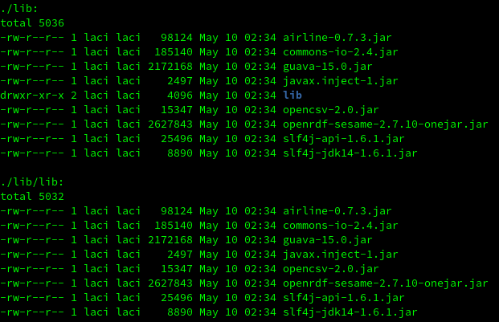
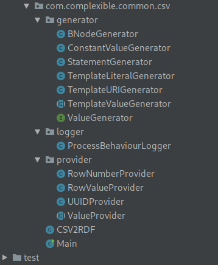

# Kódszervezés javítása

A projekt mappaszerkezetét újra kellett gondolni a Maven beüzemelése miatt. A projektből eltávolítottuk a szétszórt módon szervezett lib mappát, mert a Maven beüzemelése után már nem volt rá szükség.

    
<em>Szétszórt módon szervezett lib mappa. A mappa tartalmát az `ls -lR` parancs segítségével jelenítettük meg. Rövid elmélkedés után beláttuk, hogy a belső lib mappa csak véletlenül került a mappába.</em>

A src mappa belső struktúráját a Maven által elvárt struktúrához igazítottuk. A projekt eredetileg nem tartalmazott egységteszteket, ezért próbaképpen néhányat létrehoztunk a teszt mappában és a Maven segítségével kipróbáltuk a futtatást.

Némileg időigényesebb folyamat volt a projekt *egyetlen* forrásállományának tartalmát több fájlba szervezni. Létrehoztunk új csomagokat a logger, provider és generator csomagokat. Ezekben elhelyeztük a csomagba tartozó osztályokat.

    
<em>A csapat által végzett refaktoring eredménye.</em>

> Látható, hogy a refaktoring hatására kód szervezettsége jelentősen javult, sokkal hatékonyabban tudtuk így a többi műveletet elvégezni, mint a korábbi egyetlen forrásállományon lehetett volna. Kisebb projektek esetén is érdemes a forráskódot több állományba szervezni.

A forráskód szétbontása több nehézséget okotott. Az osztályok nem véletlenül szerepeltek statikus belső osztályként az ereredti CSV2RDF osztályban. Az eredeti osztályok között sűrű függőségi háló volt, így az IntelliJ IDEA eszköz segítségével generálnunk kellett néhány hiányzó *getter* és *setter* metódust.

A projekt **dependency injection** mintát alkalmazott a ValueFactory implementáció kiválasztásához. A refaktoring során oly módon alakítottuk a forrásállományt, hogy továbbra is csak egy helyen kelljen az implementációra hivatkozni. Alapvetően a munka során lehetőség szerint igyekeztünk minimalizálni a nem privát adattagok számát, azonban a dependency injection minta alkalmazásához helyesnek ítéltük `public static final` attribútumok használatát.

> **Dependency injection** alkalmazása esetén elég egyetlen forrásállományban hivatkozni a program által igénybevett egy szolgáltatás konkrét implementációjára. Így amennyiben később egy igénybevett függőség egy más implementációját választjuk, elég a forráskódot egyetlen helyen módosítani.

A refaktoring után statikus kód analízist futtattunk, erről bővebb információ a következő fejezetben található.

